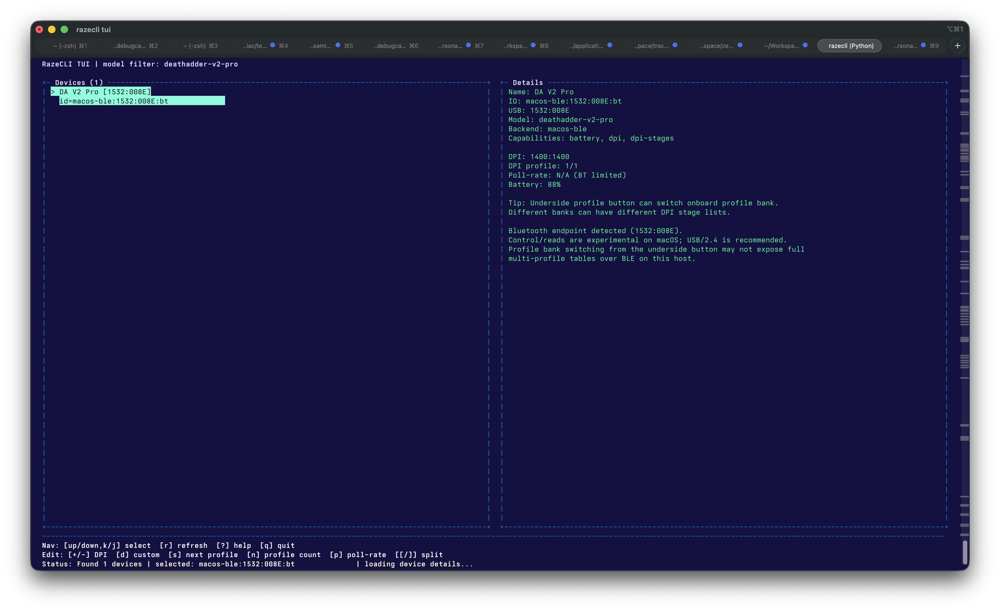
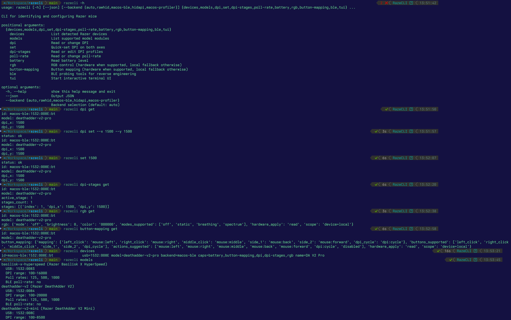
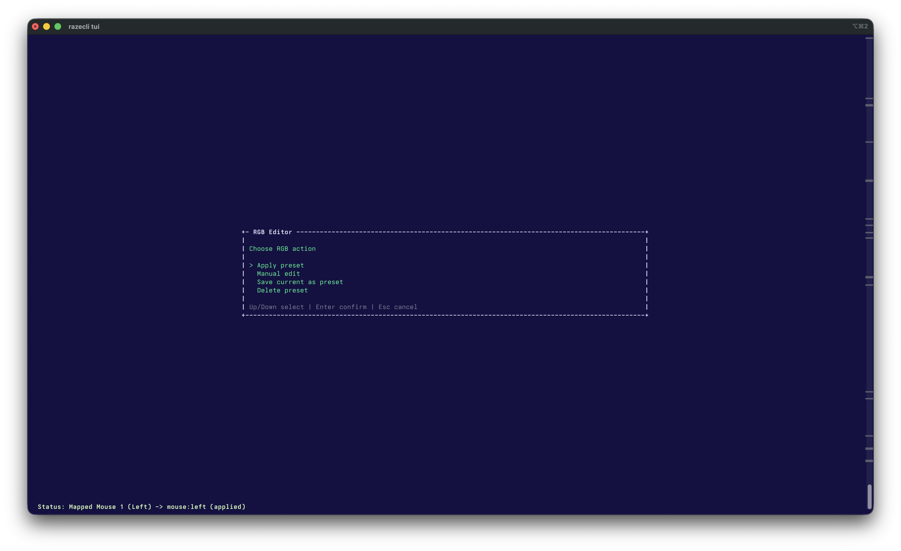
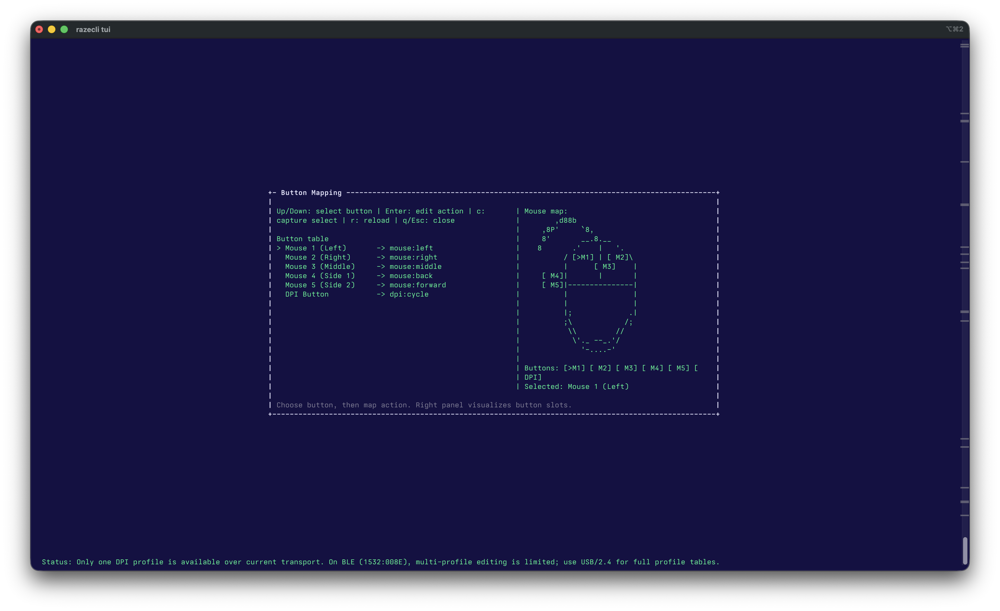

# RazeCLI

RazeCLI exists to make on-the-fly Razer mouse changes simple over USB, 2.4G dongle, and Bluetooth.

The goal is a fast, lightweight, open source tool that avoids heavy vendor software installs.
Current focus is practical settings: DPI, DPI stages, poll-rate, and battery where supported.
RGB and button mapping now run hardware-first on supported backends (currently experimental on `macos-ble` for DA V2 Pro), with confidence-aware read state and local fallback persistence when unsupported.






Supported models:
- `deathadder-v2-pro` (`1532:007C`, `1532:007D`, `1532:008E`)
- `deathadder-v2` (`1532:0084`)
- `deathadder-v2-mini` (`1532:008C`)
- `basilisk-x-hyperspeed` (`1532:0083`)

## Current Status

- USB mode (`007C`) and 2.4G dongle mode (`007D`) are the most stable paths.
- Poll-rate over USB/dongle is available via `rawhid` on supported models.
- Bluetooth endpoint (`008E`) is handled by a dedicated macOS GATT backend: `macos-ble`.
- Bluetooth support is still experimental on macOS and connect/discovery can fail on some hosts.
- Poll-rate over Bluetooth is model-gated in `macos-ble`.
- Model config is the primary switch (`ble_poll_rate_supported` / `ble_supported_poll_rates` in `razecli/models/*.py`).
- For `deathadder-v2-pro`, poll-rate is treated as USB/2.4-only on BLE.
- Runtime probing is still off by default; set `RAZECLI_BLE_POLL_CAP=1`.
- Optional runtime allowlist override: `RAZECLI_BLE_POLL_SUPPORTED_MODELS=<slug1,slug2>`.
- Some BT firmware/host combinations appear to expose no poll-rate transport at all; probing can return explicit reject status and `get/set` may remain unavailable.
- Poll-rate over Bluetooth may require per-device key overrides (`RAZECLI_BLE_POLL_READ_KEYS` / `RAZECLI_BLE_POLL_WRITE_KEYS`).
- Protocol framing follows known Razer packet structure, with additional BLE reverse-engineering work.
- Most real-hardware validation has been done on DeathAdder V2 Pro. Other models may need key/path tuning; see `Adding BT Support for More Razer Models`.

## Backend Capability Overview

Status legend:
- `verified`: repeatedly validated on supported transport/model.
- `partial`: implemented but still model/firmware or host dependent.
- `fallback`: local scaffold only (no reliable hardware read/write yet).

### `rawhid` (`007C`/`007D`)
- Detect/list devices: `verified`
- DPI get/set: `verified`
- DPI levels (`dpi-stages`): `verified`
- Poll-rate get/set: `verified`
- Battery get: `verified`
- RGB get/set: `partial`
- Button mapping get/set: `partial`

### `macos-ble` (`008E`, DA V2 Pro focus)
- Detect/list devices: `verified`
- DPI get/set: `verified`
- DPI levels (`dpi-stages`): `partial` (bank/profile dependent)
- Poll-rate get/set: `partial` (model-gated; DA V2 Pro BT intentionally disabled)
- Battery get: `partial` (BLE session quality dependent)
- RGB get/set: `partial` (mode selector better mapped than brightness/color read)
- Button mapping get/set: `partial` (main mouse buttons verified; some slots inferred)

### `hidapi`
- Detect/list devices: `partial`
- DPI get/set: `fallback`
- DPI levels (`dpi-stages`): `fallback`
- Poll-rate get/set: `fallback`
- Battery get: `fallback`
- RGB get/set: `fallback`
- Button mapping get/set: `fallback`

### `macos-profiler`
- Detect/list devices: `verified`
- DPI get/set: `fallback`
- DPI levels (`dpi-stages`): `fallback`
- Poll-rate get/set: `fallback`
- Battery get: `fallback`
- RGB get/set: `fallback`
- Button mapping get/set: `fallback`

## Features

- Hardware detection of connected Razer devices
- Modular model registry (`razecli/models/*.py`)
- DPI get/set
- DPI profiles (stages) get/set/add/update/remove/activate
- DPI stage presets (save/load/list/delete)
- Poll-rate get/set
- Battery level (when backend/device supports it)
- RGB command path with hardware-first + local fallback behavior
- Button-mapping command path with hardware-first + local fallback behavior
- JSON output for scripting

## Feature Gap (Local Backends)

- **DPI**
  Available now: `get/set` + stages + presets on `rawhid`; experimental on `macos-ble`.
  Missing for production: more BT model key mappings.
  Next local priority: expand BT key maps per model and add fixture-based tests.

- **Poll-rate**
  Available now: `get/set` on `rawhid`; experimental BT probing in `macos-ble`.
  Missing for production: stable BT write/read mapping on more hosts/models.
  Next local priority: promote verified BT key mappings and tighten verification.

- **Battery**
  Available now: `get` on `rawhid`; BT read path in `macos-ble`.
  Missing for production: better reconnect robustness on unstable BLE sessions.
  Next local priority: add retry/backoff and host-specific fallback paths.

- **RGB**
  Available now: experimental DA V2 Pro hardware path on `macos-ble` (`off/static/breathing/breathing-single/breathing-random/spectrum`) plus CLI/TUI editing and presets, with local fallback persistence.
  Missing for production: stable brightness/color readback mapping on BLE across reconnects and broader cross-model validation.
  Next local priority: promote verified BLE RGB read keys and add `rawhid` parity.

- **Button mapping**
  Available now: experimental DA V2 Pro hardware path on `macos-ble` for mouse actions (`mouse:*` incl. scroll), `dpi:cycle`, keyboard actions, and turbo variants, with read-confidence reporting (`verified`/`mixed`/`inferred`) and local fallback persistence.
  Missing for production: explicit decode coverage for all button slots/actions across more models plus `rawhid` parity.
  Next local priority: complete slot/action decode map and expand model fixtures.

- **RGB/button UX**
  Available now: CLI + TUI editors (`g` for RGB with presets, `b` for button-mapping table/editor), lazy-loading state in main view, and confidence display in JSON output.
  Missing for production: fully reliable physical-button capture on all macOS permission setups and broader cross-model UX validation.
  Next local priority: harden capture-assist fallback paths and keep dialogs fast on unstable BLE hosts.

## Next Local Priorities

1. Finalize BLE RGB read mapping (mode + brightness + color) so `rgb get` can be treated as fully verified on DA V2 Pro.
2. Add DA V2 Pro RGB/button parity paths in `rawhid` where transport permits.
3. Expand bank/profile-safe DPI workflows and fixtures for reconnect/profile-switch scenarios.
4. Extend model coverage after DA V2 Pro paths are validated with repeatable fixtures and hardware runs.

## Architecture

- `razecli/models/`: one file per model (`MODEL = ModelSpec(...)`)
- `razecli/model_registry.py`: dynamic model loader
- `razecli/backends/rawhid_backend.py`: direct HID packet control via `hidapi` (USB + experimental BT)
- `razecli/backends/macos_ble_backend.py`: dedicated experimental BT backend for `008E` on macOS (vendor GATT)
- `razecli/backends/hidapi_backend.py`: detection fallback
- `razecli/backends/macos_profiler_backend.py`: macOS detection via `system_profiler` (USB + Bluetooth)

## How It Works

- `rawhid` sends 90-byte Razer feature reports.
- CLI/TUI calls the selected backend (`rawhid`, `macos-ble`, `hidapi`, `macos-profiler`).
- Model modules in `razecli/models/` define USB IDs and constraints; registry loads them dynamically.
- Cross-transport autosync is opt-in via `RAZECLI_AUTOSYNC=1` (disabled by default for stability).

## Requirements

Option A (`rawhid` backend):
- `hidapi` installed.
- DeathAdder V2 Pro control works in direct HID mode (`007C`/`007D`).
- Bluetooth PID `008E` in `rawhid` is experimental and host/driver dependent.

Option B (BLE reverse engineering):
- `bleak` installed for GATT scan/probe.

Install `hidapi`:

```bash
python -m pip install "hidapi>=0.14"
```

Install BLE probe extras:

```bash
python -m pip install -e '.[ble]'
```

## Installation

```bash
python -m pip install -e .
```

## Run Without Activating venv

Option 1 (recommended for development): install with `pipx` and run `razecli` directly.

```bash
brew install pipx
pipx ensurepath
pipx install --editable ".[detect]"
razecli --help
```

Option 2 (distribution): build a standalone macOS binary (no Python required on target machine).

```bash
./scripts/build_macos_onefile.sh
./dist/razecli --help
```

The build script creates a self-contained executable in `dist/`.  
Use that binary directly on machines where you do not want to manage Python/venv.

Option 3 (fast local executable): build an onedir bundle (larger output, much faster startup than `--onefile`).

```bash
./scripts/build_macos_onedir.sh
./dist/razecli-onedir/razecli-onedir --help
```

`onedir` starts faster because it does not self-extract on each launch.  
`onefile` is easier to share because it ships as a single executable file.

Option 4 (no venv, install latest release binary):

```bash
./scripts/install_latest_release_binary.sh
razecli --help
```

The installer downloads the latest packaged `onedir` binary and prompts:
- `1` to install at `~/bin/razecli`
- `2` to enter a custom install path
It installs a `razecli` launcher plus the required bundled runtime directory.
No system Python is required on the target Mac.
The release binary includes BLE runtime dependencies (`bleak`) for `macos-ble` commands.

Direct install link (run from anywhere):
```bash
curl -fsSL "https://raw.githubusercontent.com/compilererrors/RazeCLI/main/scripts/install_latest_release_binary.sh" | bash
```

Non-interactive custom path:

```bash
curl -fsSL "https://raw.githubusercontent.com/compilererrors/RazeCLI/main/scripts/install_latest_release_binary.sh" \
  | RAZECLI_INSTALL_PATH="$HOME/.local/bin/razecli" bash
```

Architecture handling:
- Apple Silicon (`arm64`) downloads `razecli-onedir-macos-arm64.tar.gz`
- Intel (`x86_64`) downloads `razecli-onedir-macos-x86_64.tar.gz`

## Usage

List models:

```bash
razecli models
```

List devices:

```bash
razecli devices
```

Show all transport endpoints separately (USB/dongle/BT):

```bash
razecli devices --all-transports
```

Show devices for one model:

```bash
razecli devices --model deathadder-v2-pro
```

Read DPI:

```bash
razecli dpi get
```

Set DPI (X/Y):

```bash
razecli dpi set --x 1600 --y 1600
```

Read DPI stages:

```bash
razecli dpi-stages get
```

Replace all DPI stages:

```bash
razecli dpi-stages set --active 2 --stage 800:800 --stage 1600:1600 --stage 3200:3200
```

Add a stage:

```bash
razecli dpi-stages add --x 2400 --y 2400
razecli dpi-stages add --x 2400 --y 2400 --active
```

Update/remove/activate stage:

```bash
razecli dpi-stages update --index 2 --x 1800 --y 1800
razecli dpi-stages remove --index 3
razecli dpi-stages activate --index 1
```

Save/load presets (quick restore):

```bash
razecli dpi-stages preset save --name fps3
razecli dpi-stages preset load --name fps3
razecli dpi-stages preset list
razecli dpi-stages preset delete --name fps3
```

Read poll-rate:

```bash
razecli poll-rate get
```

Set poll-rate:

```bash
razecli poll-rate set --hz 1000
```

Read battery:

```bash
razecli battery get
```

RGB (hardware-first when backend supports it, local fallback otherwise):

```bash
razecli rgb get
razecli rgb set --mode static --brightness 55 --color 00ff88
razecli rgb set --mode breathing --brightness 45 --color ff5500
razecli rgb set --mode breathing-single --brightness 45 --color ff5500
razecli rgb set --mode breathing-random --brightness 45 --color ff5500
razecli rgb set --mode spectrum --brightness 60
```

Button mapping (hardware-first when backend supports it, local fallback otherwise):

```bash
razecli button-mapping get
razecli button-mapping actions
razecli button-mapping set --button side_1 --action mouse:back
razecli button-mapping set --button side_2 --action mouse:scroll-down
razecli button-mapping set --button side_1 --action keyboard:0x2c
razecli button-mapping set --button side_1 --action mouse-turbo:mouse:left:142
razecli button-mapping reset
```

Start TUI:

```bash
razecli tui
```

Show all models in TUI:

```bash
razecli tui --all-models
```

Show all transport endpoints in TUI:

```bash
razecli tui --all-transports
```

JSON output:

```bash
razecli --json devices
razecli --json dpi get
```

BLE probing (GATT):

```bash
razecli ble scan --name Razer
razecli --json ble services --name "DA V2 Pro"
razecli --json ble services --address 02:11:22:33:44:55 --read
```

BLE alias cache (MAC -> CoreBluetooth UUID):

```bash
razecli --json ble alias list
razecli --json ble alias resolve --address 02:11:22:33:44:55
razecli --json ble alias clear --address 02:11:22:33:44:55
razecli --json ble alias clear --all
```

Experimental raw BLE transceive over Razer vendor service (`...1524/1525/1526`):

```bash
razecli --json ble raw --name "DA V2 Pro" --payload "00 ff 01"
razecli --json ble raw --address 02:11:22:33:44:55 --payload "00ff01" --response-timeout 2.0
razecli --json ble raw --name "DA V2 Pro" --payload "00 ff 01" --no-notify --no-read
```

Notes:
- `ble raw` is a reverse-engineering tool (experimental).
- `macos-ble` now uses the same vendor-GATT path for battery + DPI + DPI stages.
- In the macOS Bluetooth UI, the device may appear as `DA V2 Pro` instead of `Razer ...`.
- `ble services --address <MAC>` tries to auto-resolve MAC to CoreBluetooth UUID if needed.
- Fast candidate matching is used by default; set `RAZECLI_BLE_BRUTEFORCE=1` for a slower, more aggressive probe.
- Successful MAC -> UUID mapping is cached in `~/.config/razecli/ble_aliases.json` (override with `RAZECLI_BLE_ALIAS_PATH`).
- `macos-ble` automatically retries with a discovered writable/notify GATT path if the default vendor UUID path is missing.

Backend override (troubleshooting):

```bash
razecli --backend rawhid devices
razecli --backend rawhid dpi get
razecli --backend rawhid poll-rate set --hz 1000
razecli --backend rawhid battery get
razecli --backend macos-ble devices --model deathadder-v2-pro
razecli --backend macos-ble dpi get --model deathadder-v2-pro
razecli --backend macos-ble dpi-stages get --model deathadder-v2-pro
razecli --backend macos-ble battery get --model deathadder-v2-pro
razecli --backend macos-profiler devices
razecli --backend hidapi devices
razecli --backend macos-profiler tui --all-models
```

Bluetooth in `rawhid` (`008E`) is experimental HID mode. On macOS BT, prefer `--backend macos-ble`.

Debug rawhid BT probe (path/rid/tx attempts on stderr):

```bash
RAZECLI_RAWHID_DEBUG=1 razecli --backend rawhid dpi get --model deathadder-v2-pro
```

If you see `IOHIDDeviceSetReport ... 0xE00002F0`, switch to `--backend macos-ble` (GATT) instead of raw HID.

Optional probe overrides:

```bash
RAZECLI_RAWHID_TX_IDS=0x3F,0x1F,0xFF \
RAZECLI_RAWHID_REPORT_IDS=0x00,0x02 \
RAZECLI_RAWHID_EXPERIMENTAL_ATTEMPTS=8 \
razecli --backend macos-ble dpi get --model deathadder-v2-pro
```

Experimental BT poll-rate mapping (vendor keys):

```bash
# Optional: expose BT poll-rate capability for specific model slugs only
RAZECLI_BLE_POLL_CAP=1 \
RAZECLI_BLE_POLL_SUPPORTED_MODELS=basilisk-x-hyperspeed \
razecli --backend macos-ble devices

# Optional: override candidate vendor keys for poll read/write
RAZECLI_BLE_POLL_READ_KEYS=00850001,00850000 \
RAZECLI_BLE_POLL_WRITE_KEYS=00050001,00050000 \
RAZECLI_BLE_POLL_CAP=1 \
RAZECLI_BLE_POLL_SUPPORTED_MODELS=basilisk-x-hyperspeed \
razecli --backend macos-ble poll-rate get --model basilisk-x-hyperspeed

# Force probe regardless of model policy (for reverse engineering only)
RAZECLI_BLE_POLL_FORCE=1 RAZECLI_BLE_POLL_CAP=1 razecli --backend macos-ble poll-rate get --model deathadder-v2-pro

# Focused BT poll-rate probe with per-key decode output
razecli --json ble poll-probe --address F6:F2:0D:4E:D9:30 --attempts 2
```

Experimental BLE RGB/button/profile-bank probes (reverse engineering tools):

```bash
# RGB key probing + decode hints (mode/brightness/frame)
razecli --json ble rgb-probe --address F6:F2:0D:4E:D9:30 --attempts 2

# Button slot probing + decoded action when known
razecli --json ble button-probe --address F6:F2:0D:4E:D9:30 --attempts 2

# Profile-bank probing and snapshots
razecli --json ble bank-probe --address F6:F2:0D:4E:D9:30 --attempts 2
razecli --json ble bank-probe --address F6:F2:0D:4E:D9:30 --attempts 2 --deep
razecli --json ble bank-snapshot --address F6:F2:0D:4E:D9:30 --attempts 2 --label bank-a
razecli --json ble bank-snapshot --address F6:F2:0D:4E:D9:30 --attempts 2 --label bank-b
razecli --json ble bank-compare --label-a bank-a --label-b bank-b
```

## Safe vs Legacy Stage Activation

- Default behavior (`safe`):
  - `dpi-stages activate --index N` and `s` in TUI do **not** rewrite the full stage table.
  - They only set DPI to the selected stage value (`set_dpi`).
  - This is safer on unstable firmware/transport combinations where full stage rewrites may reset stages unexpectedly.

- Legacy behavior (`unsafe`):
  - Enable with `RAZECLI_UNSAFE_STAGE_ACTIVATE=1`.
  - Activation rewrites the full stage list and active index (`set_dpi_stages`).
  - This can be useful when you explicitly need stage-index semantics, but it is more likely to trigger profile resets on problematic transports.

## Why `--backend macos-ble` May Return No Devices

`macos-ble` is BT-only and only targets the Bluetooth endpoint (`1532:008E`).

If `razecli --backend macos-ble --json devices --model deathadder-v2-pro` returns `[]`:
- Make sure the mouse is switched to Bluetooth mode (not USB/dongle mode).
- Confirm it is connected in macOS Bluetooth settings.
- Run `razecli --json ble scan --name "DA"` and then probe with `ble services`.
- If name/MAC resolution is unstable, retry with `RAZECLI_BLE_BRUTEFORCE=1`.

## Adding BT Support for More Razer Models

`macos-ble` can be expanded to additional product IDs that expose the same vendor service.

- Default BT PID set includes `0x008E` and `0x0083`.
- Override/extend at runtime:

```bash
RAZECLI_BLE_PRODUCT_IDS=0x008E,0x0083,0x00A5 razecli --backend macos-ble --json devices
```

Recommended workflow when adding a new BT model:

1. Verify detection:
`razecli --backend macos-ble --json devices --all-transports`
2. Verify GATT service/characteristics:
`razecli --json ble services --name "<device name>"`
3. Test vendor transaction path:
`razecli --json ble raw --name "<device name>" --payload "30 00 00 00 05 81 00 01"`
4. Map keys for battery/DPI/stages/poll-rate and add/update backend key map.
5. For BT poll-rate rollout, only allowlist model slug after real hardware validation:
`RAZECLI_BLE_POLL_SUPPORTED_MODELS=<model-slug>`
6. Add/extend tests in `tests/test_macos_ble_backend.py` and `tests/test_ble_probe.py`.

## TUI Shortcuts

- `q`: quit
- `r`: refresh device list
- `up/down` or `k/j`: select device
- `+` / `-`: change DPI by configured keyboard step (`n` -> "Set keyboard +/- adjustment step")
- `d`: enter custom DPI X/Y
- `g`: open RGB editor dialog (manual edit + apply/save/delete presets)
- `b`: open button-mapping table/editor dialog
- `s`: switch to next DPI stage (on devices with `dpi-stages`)
- `n`: open DPI levels editor (count, stage ladder with increment, preset load/save/delete)
- `p`: cycle poll-rate

Inside the button-mapping dialog:
- `up/down` or `k/j`: select button row
- `Enter`: choose action for selected button
- `c`: capture assist (global mouse-click hook, falls back to manual when unavailable)
- `r`: reload mapping from backend
- `q`/`Esc`: close dialog

Capture assist uses optional `pynput` for global mouse events.  
Install with `python -m pip install pynput` and grant macOS Accessibility/Input Monitoring permissions if prompted.

## Add a New Model

1. Create a file in `razecli/models/`, for example `viper_v2_pro.py`.
2. Export `MODEL = ModelSpec(...)` with USB IDs and constraints.
3. Done: the registry auto-loads the model.

Example:

```python
from razecli.models.base import ModelSpec, RawHidPidSpec

MODEL = ModelSpec(
    slug="viper-v2-pro",
    name="Razer Viper V2 Pro",
    usb_ids=((0x1532, 0x00A5), (0x1532, 0x00A6)),
    dpi_min=100,
    dpi_max=30000,
    supported_poll_rates=(125, 500, 1000),
    ble_poll_rate_supported=False,
    ble_supported_poll_rates=(),
    ble_supported_rgb_modes=("off", "static"),
    ble_endpoint_product_ids=(0x00A6,),
    ble_endpoint_experimental=True,
    ble_multi_profile_table_limited=False,
    onboard_profile_bank_switch=False,
    rawhid_mirror_product_ids=(0x00A5,),
    rawhid_pid_specs=(
        RawHidPidSpec(
            product_id=0x00A5,
            capabilities=("dpi", "dpi-stages", "poll-rate", "battery"),
            experimental=True,
        ),
    ),
    rawhid_transport_priority=(0x00A5, 0x00A6),
    cli_default_target=False,
    ble_button_decode_layouts=("razer-v1",),
)
```

`ble_poll_rate_supported` and `ble_supported_poll_rates` are the model-level switches for BT poll-rate rollout.
Set them only after validated hardware captures for that specific model/firmware.
BLE endpoint behavior and transport-mirror behavior should also be declared in `ModelSpec`, not hardcoded in controllers/backends.
CLI/TUI default target selection and rawhid transport preference should also come from `ModelSpec`
(`cli_default_target`, `rawhid_transport_priority`) so adding a new model does not require branch logic edits.
Rawhid support profiles should be declared in `rawhid_pid_specs` and BLE button decoding behavior in
`ble_button_decode_layouts` to avoid per-model hardcoded branches in backends.

## Additional Notes

- Terminology for users:
  - `DPI levels` = the DPI steps you cycle with the top DPI buttons near the scroll wheel.
  - `Onboard profile` (sometimes called `bank` in RE/debug output) = the profile slot you switch with the bottom profile button.
  - Each onboard profile can keep its own DPI level table, active DPI level, and LED/profile indicator behavior.
  - In practice: first select onboard profile with the bottom button, then edit DPI levels for that profile.
- Backend auto-priority is `rawhid` > `macos-ble` > `hidapi` > `macos-profiler`.
- If multiple devices match, pass `--device`.
- `rawhid` collapses transport variants by default using model-declared `rawhid_transport_priority`. Use `--all-transports` to see each endpoint.
- `tui` defaults to the model marked with `cli_default_target=True`. Use `razecli tui --all-models` to view everything detected.
- `macos-profiler` is detect-only and cannot write DPI, DPI stages, poll-rate, or battery.
- `macos-ble` targets BT reverse engineering for `008E` and reuses Razer packet framing over vendor GATT.
- DeathAdder V2 Pro supports up to 5 DPI stages per active onboard profile bank.
- The bottom DPI button/LED can switch onboard banks; stage count/values may differ between banks.
- `007C` (USB) and `007D` (dongle) transport mirroring is disabled by default.
- Enable mirror only when needed: `RAZECLI_TRANSPORT_MIRROR=1`.
- Bluetooth endpoint `008E` is excluded from mirror mode.
- Optional USB/BT autosync can be enabled with `RAZECLI_AUTOSYNC=1`.
- See [BLE reverse engineering plan](docs/ble_reverse_engineering_plan.md) for capture workflow.
